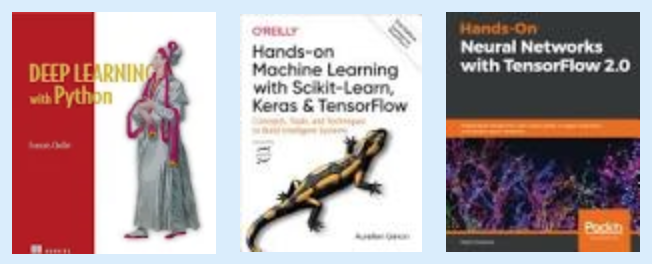

# github.com/Vadikus/practicalDL

## Educational materials for Frontend Masters course "A Practical Guide to Deep Learning with TensorFlow 2.0 and Keras"

## Setup

Prerequisite: Python

To use Jupyter Notebooks on your computer - please follow the [installation instructions](https://jupyter.readthedocs.io/en/latest/install.html).
Note: Anaconda installation is recommended if you are not familiar with other Python package management systems. 

### Guided Steps

* Install dependencies

    ```bash
    pip install -r requirements.txt
    ```

* Run jupyter notebook

    ```bash
    jupyter notebook
    ```

## Agenda/Curriculum
    
### 00) Introductions:
- 🙋‍♂️ About myself 
- About this course/workshop - quick demo & tools overview
    - 🎨 Whiteboard drawings
    - 📝 Jupyter Notebooks
    - 👨🏻‍💻 Terminal commands (pip, jupyter -> !cmd, pyenv & conda)
    - 💻 GitHub repos (for class, TFJS -> 🎥 [**pose demo**](https://storage.googleapis.com/tfjs-models/demos/posenet/camera.html) 🕺, books repos, TF/Keras demos)
    - 🕸 Websites (TF, TF-hub)
    - 📚 Books:
	
        - "Deep Learning with Python" by [François Chollet](https://github.com/fchollet/deep-learning-with-python-notebooks)
        - "Hands-On Machine Learning with Scikit-Learn, Keras, and TensorFlow: Concepts, Tools, and Techniques to Build Intelligent Systems" by [Aurélien Géron](https://github.com/ageron/handson-ml2)
        - "Hands-On Neural Networks with TensorFlow 2.0" by [Paolo Galeone](https://github.com/PacktPublishing/Hands-On-Neural-Networks-with-TensorFlow-2.0)
- (plot) What is the difference between Statistics / Machine Learning / Deep Learning / Artificial Intelligence?
@matvelloso. Shoes size example. Information reduction.
- (plot) Compute + Algorithm + IO
- (plot) Why now, AI? Chronological retrospective.
- (plot) Hardware advances: SIMD, Tensor Cores, TPU, FPGA, Quantum Computing
- (plot) HW, compilers, TensorFlow and Keras -> computational graph, memory allocation


### 0) Don't be scared of Linear Regressions - it does not "byte"!.. Basic Terminology:
- Linear regression Notebook
- 🐵🧠 (plot) What is neuron? What is activation function?

### 1)  👀 Computer Vision:

- ✍🏻 Handwritten digits (MNIST) recognized with fully connected neural network
- 📸 (plot) One-hot encoding
- 👁 Information theory and representation: MNIST Principal Component Analysis
- 🙈 (plot) Fully connected vs. convolutional neural network
- 📷 (plot + Notebook) Convolutions, pooling, dropouts
- 🛒 (plot) Transfer learning and different topologies
- 🎨 Style transfer
- 🧐 (Convolutional) Neural Network attention - ML explainability

### 2) Text Analytics - Natural Language Processing (NLP):
- 🤬 Toxicity demo
- 📝 (plot) How to represent text as numbers? Text vectorization: one-hot encoding, tokenization, word embeddings
- 🙊 IMDB movies review dataset prediction with hot-encoding in Keras
- 🤯 Word embeddings and [Embedding Projector](http://projector.tensorflow.org/)
- 🗒 Embedding vs hot-encoding and Fully Connected Neural Network for IMDB
- 📒 Can LSTM guess the author?

### 3) Can Robot juggle? Reinforcement Learning:
- 🎭 (plot) Actors and environment
- Reinforcement learning

### 4) Operationalization, aka "10 ways to put your slapdash code into production..."
- (plot) Data - Training - Deployment aka MLOps or CI/CD for Data Scientists

### 5) Summary
- Quick recap what we learned so far
